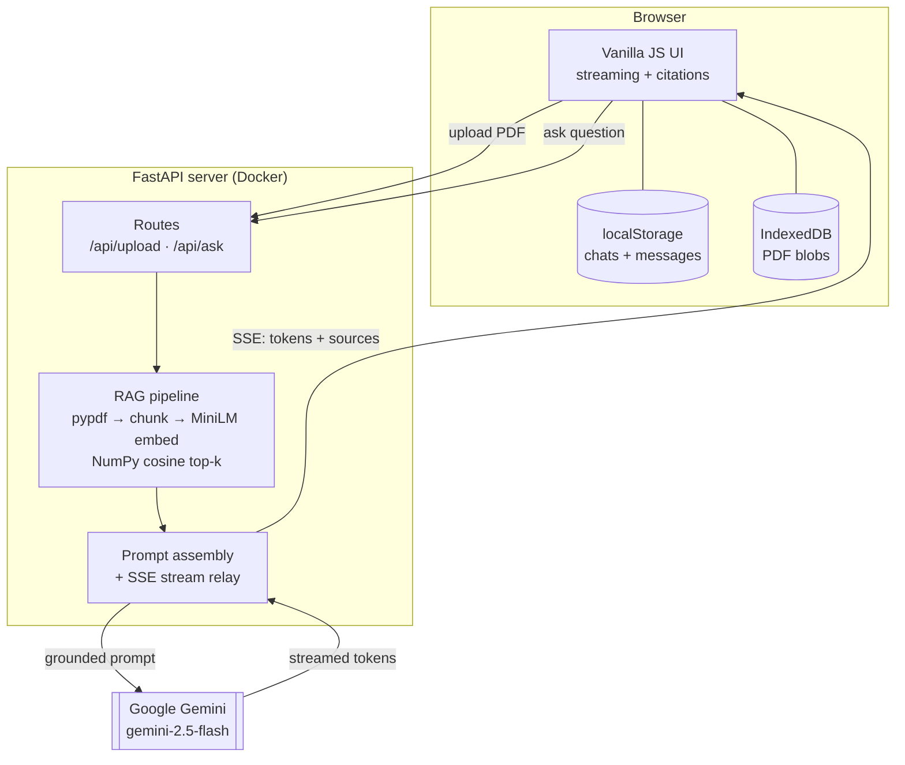

# PaperLens

> Chat with any PDF. Upload a document, ask questions in plain language, and get streamed answers with inline citations pointing to the exact source pages.

A full-stack retrieval-augmented generation (RAG) app — FastAPI backend, vanilla-JS frontend, Google Gemini for answers — that runs end-to-end on a free tier.

## Features

- 📄 **PDF Q&A** — upload a PDF and ask anything about it
- ⚡ **Streaming answers** — responses render token-by-token as they're generated
- 🔖 **Inline citations** — every claim is tagged with the source page it came from
- ✍️ **Markdown formatting** — bold, lists, headings, and tables render cleanly
- 🗂️ **Multi-chat library** — documents and conversations are saved in your browser
- 🐳 **Containerized** — one `docker run` to start; deployable to AWS free tier

## Architecture



The backend is stateless and holds a single document's vector index in memory; chat history and PDF bytes are persisted in the browser (localStorage + IndexedDB). The model answers **only** from the retrieved passages, so every response is grounded in the document and traceable to a page.

## Tech stack

| Layer | Tools |
|-------|-------|
| Backend | Python 3.12, FastAPI, Uvicorn |
| Retrieval | pypdf, sentence-transformers (`all-MiniLM-L6-v2`), NumPy |
| LLM | Google Gemini (`gemini-2.5-flash`) via `google-genai` |
| Frontend | Vanilla HTML / CSS / JavaScript |
| Deploy | Docker, AWS Elastic Beanstalk |

## Getting started

**Prerequisites:** Python 3.12+ and a free Gemini API key from [Google AI Studio](https://aistudio.google.com/apikey).

```bash
git clone https://github.com/mani-995/PaperLens.git
cd PaperLens

python -m venv .venv
.venv\Scripts\activate            # Windows  (use: source .venv/bin/activate  on macOS/Linux)
pip install -r requirements.txt
```

Create a `.env` file in the project root:

```
GEMINI_API_KEY=your-key-here
```

Then start the server:

```bash
uvicorn app.main:app --reload
```

Open **http://localhost:8000**.

## Run with Docker

```bash
docker build -t paperlens .
docker run -p 8000:8000 -e GEMINI_API_KEY=your-key paperlens
```

## Deployment

Deploys to AWS Elastic Beanstalk on a single `t3.micro` (free tier), Docker platform, with the API key set as an environment property.
## Configuration

| Variable | Required | Description |
|----------|----------|-------------|
| `GEMINI_API_KEY` | Yes | Google AI Studio API key |
| `GEMINI_MODEL` | No | Override the model (default `gemini-2.5-flash`) |

The key is read only from the environment — never hardcoded, logged, or sent to the browser.
